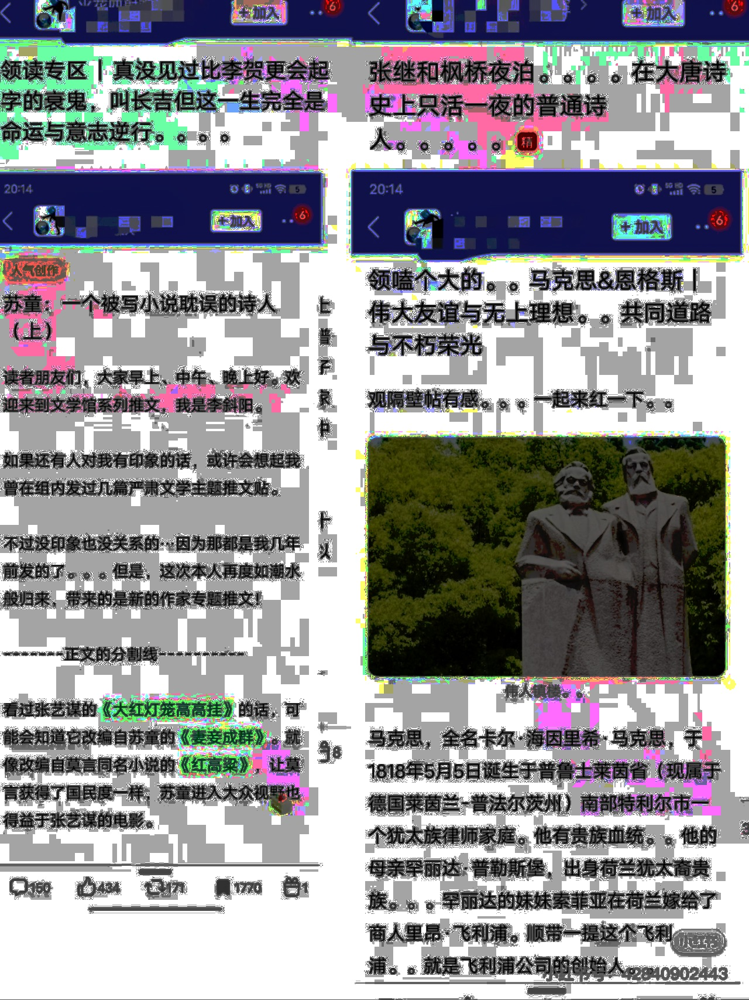
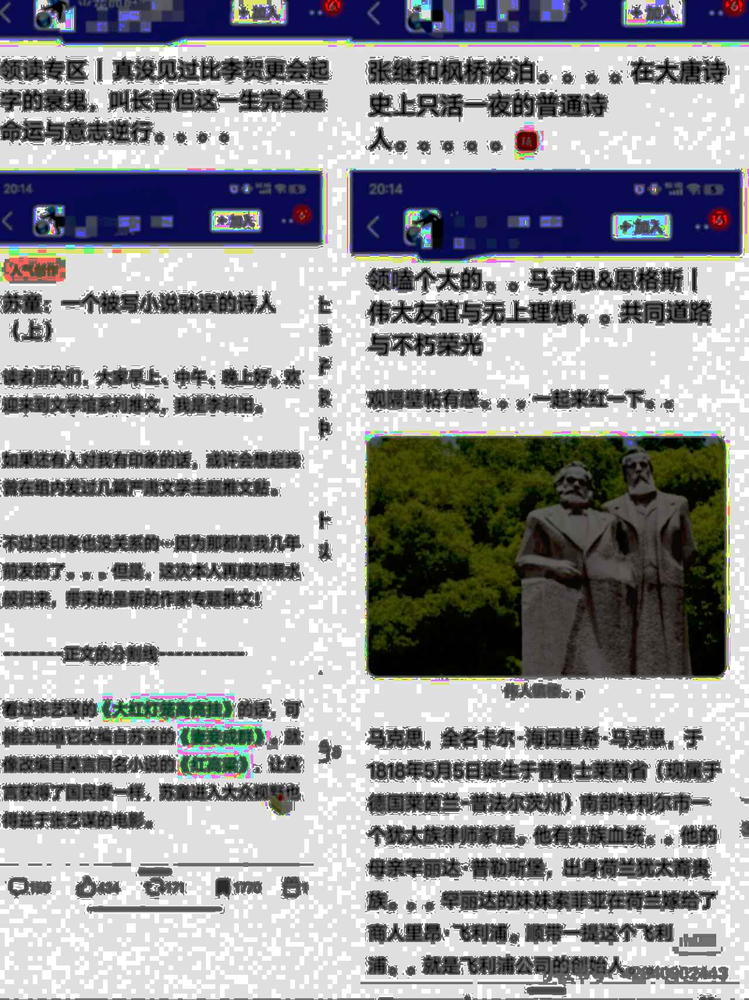

# aftermark


**Obliterate hidden watermarks from platform screenshots.**

## Why

Many modern platforms embed user-specific watermarks into app screenshots. These watermarks are **invisible** to the eye but **detectable** via equalization or frequency analysis. Some are LSB-based, some render [snow-like patterns](#before--after) across RGB channels. Some even survive compression. They are all *a form of tracking*. And no one should be silently tagged just for sharing a screenshot.

**Two-thirds** of high-traffic mobile apps in China now tag screenshots; many started in 2022 after [Douban](https://pandaily.com/douban-app-screenshots-contain-user-information-watermark) & [Zhihu](https://www.sixthtone.com/news/1011179) incidents. Outside China, it's still niche. Except for DRM-heavy verticals (video streaming, enterprise VDI) where "forensic" marks are universal. While tech diversity is widening, we still see classic LSB and DCT hacks. But 2024-25 papers (ScreenMark, CoreMark) chase *camera-shot-robust* patterns that sit in mid-frequency bands or irregular point clouds.

## Features

- **Crop** status bar or header manually
- **Jitter**, **blur**, and **add noise** to disrupt invisible alignment
- **Median filtering** to dissolve patterned bands
- All **automated** with CLI, batchable

## Installation

```bash
git clone https://github.com/kay-a11y/aftermark.git
cd aftermark
pip install -r requirements.txt
```

### Optional OS tools

```bash
sudo apt install -y imagemagick libimage-exiftool-perl
```

* ImageMagick - equalize / compare / attacks
* ExifTool    - deep metadata wipe

## Usage

```bash
python nuke.py IN_DIR OUT_DIR              \
             [--crop PX]                  \
             [--header PX]
```

* `--crop`  
    Hard-crops this many pixels off the top.
    Useful if you don't need the status bar.

* `--header`  
    Applies a median filter to only the first `PX` pixels (vertical).
    Cleans header-only snow bands without destroying the rest of the image.

* Example:

    ```bash
    python nuke.py ~/Screenshots/ ~/Cleaned/ --crop 96 --header 420
    ```

## Before & After

All comparisons below are shown after applying `convert -equalize` for visibility. See [demo folder](./demo/) for more examples.

| Original (Douban)          | Cleaned (aftermark)      |
| -------------------------- | ------------------------ |
|  |  |

This was scraped from a third party. The snow-pattern fingerprint of the original user still lingers beneath the surface.

## Output

* All files saved as `.jpg` with `quality=40` and `optimize=True`
* Strips all metadata by default

## Documentation

See the [full walkthrough](https://kay-a11y.github.io/). Soon.

## Further Reading

* [Helpful Resource - Stgod](https://stgod.com/1482/) (ZH)
* [Interesting Discussion on Zhihu](https://www.zhihu.com/question/517690908) (ZH)
* [Weibo Censorship Insights](https://dpclab.org/china/dashboard/)
* [Twitter Post](https://x.com/inroading/status/1566338872837308416) (ZH)